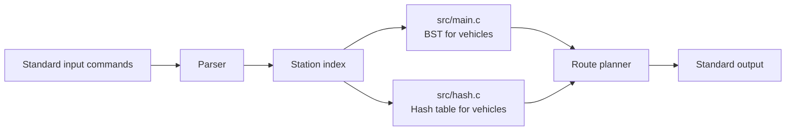

# API-PROJECT-2023

[](https://en.wikipedia.org/wiki/C_(programming_language))
[]()
[](LICENSE)
[](documentation/Project's%20Summary%20Presentation.pdf)

Final project for the *Algorithms and Principles of Computer Science* course at Politecnico di Milano.

## Table of Contents

- [Overview](#overview)
- [Features](#features)
- [Project Structure](#project-structure)
- [Prerequisites](#prerequisites)
- [Architecture](#architecture)
- [Input Commands](#input-commands)
- [Implementation Notes](#implementation-notes)
- [Build and Run](#build-and-run)
- [Example](#example)
- [Documentation](#documentation)

## Overview

This repository contains a **C implementation** of the final project developed for the course. The program manages a *network of stations and vehicles*, accepts commands from standard input, and prints the expected textual responses for each operation.

The repository includes **two standalone source variants**:

- `src/main.c` stores the vehicles of each station in a binary search tree.
- `src/hash.c` keeps the station index in a binary search tree and uses a hash table for vehicle storage.

Both versions solve the same problem with different internal **data-structure choices**.

## Architecture



## Prerequisites

- A **C compiler** with *C11 support*, such as GCC or Clang.
- A **Unix-like environment** is recommended, because the code uses `getchar_unlocked` and `putchar_unlocked` for fast I/O.
- *No external libraries are required.*

## Features

- Add a new station with its available cars.
- Remove an existing station.
- Add a car to a station.
- Scrap a car from a station.
- Plan a *feasible route* between two stations.
- Print compact command results on standard output, as required by the *project specification*.

## Project Structure

- `src/main.c`: first implementation of the project logic.
- `src/hash.c`: alternative implementation with a hash table for car lookup.
- `documentation/Project's Full Presentation.pdf`: full project presentation.
- `documentation/Project's Summary Presentation.pdf`: summary presentation.
- `LICENSE`: repository license.

## Input Commands

The program reads commands from standard input. The supported commands are:

- `aggiungi-stazione <distance> <num_cars> <autonomy_1> ... <autonomy_n>`
- `demolisci-stazione <distance>`
- `aggiungi-auto <distance> <autonomy>`
- `rottama-auto <distance> <autonomy>`
- `pianifica-percorso <start_distance> <end_distance>`

The output follows the *course specification* and uses the Italian status messages expected by the evaluator, such as `aggiunta`, `non aggiunta`, `demolita`, `rottamata`, and `nessun percorso`.

## Implementation Notes

The code is organized around a few core ideas:

- Stations are indexed by distance using a **binary search tree**.
- Vehicles are stored either in a per-station BST or in a *hash table*, depending on the source variant.
- Route planning is performed with a *Dijkstra-style traversal* over the ordered station list, reconstructing the path when a feasible route exists.

The implementation is intentionally *low-level* and optimized for fast input parsing and output printing, which matches the constraints of the original assignment.

## Build and Run

Compile one source file at a time. The **two implementations are independent** and should not be linked together.

```bash
gcc -std=c11 -O2 -Wall -Wextra -o project src/main.c
```

Or, to build the hash-table variant:

```bash
gcc -std=c11 -O2 -Wall -Wextra -o project src/hash.c
```

Run the executable by piping an input file or typing commands manually:

```bash
./project < input.txt
```

## Example

```text
aggiungi-stazione 10 3 5 10 15
aggiungi-stazione 20 2 7 12
aggiungi-auto 10 20
pianifica-percorso 10 20
```

The program prints the expected status messages and, when a route exists, the sequence of stations that form the path.

## Why Two Implementations

This repository preserves both versions of the project because they show two different approaches to the same problem:

- `src/main.c` focuses on a straightforward binary-search-tree based organization for stations and vehicles.
- `src/hash.c` uses a hash table to speed up vehicle access while keeping station ordering with a BST.

Keeping both files makes it easier to compare design trade-offs and demonstrates the evolution of the solution.

## Final Notes

This project was built as a *course final assignment*, but it also works as a compact example of how to combine **ordered structures**, **fast I/O**, and *path planning* in C.

The most relevant takeaway is the trade-off between the two versions: one favors a more direct BST-based organization, while the other introduces a hash table to improve vehicle lookup. Both remain faithful to the same specification, which makes the repository useful for *comparison, study, and presentation*.

## Documentation

- [Full Presentation](documentation/Project's%20Full%20Presentation.pdf)
- [Summary Presentation](documentation/Project's%20Summary%20Presentation.pdf)
